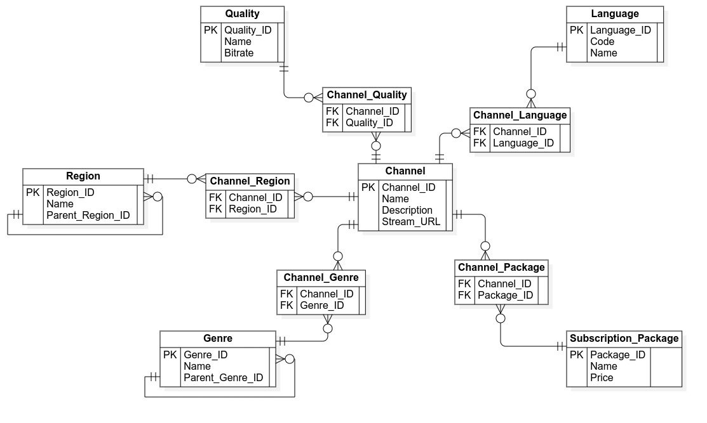

# Задание 2.19

Исследуйте пользовательский интерфейс нескольких клиентских приложений,
обеспечивающих поиск и выбор телевизионных каналов для их просмотра, и оцените
качество предлагаемых классификаторов. Используя фасетно-иерархическую
таксономию, разработайте схему и ER-модель классификатора телевизионных каналов,
предоставляемых интернет-провайдером.

## Анализ пользовательских интерфейсов IPTV/TV-приложений

При рассмотрении популярных приложений (IPTV-плееры, Smart TV интерфейсы,
YouTube, Netflix) можно выделить общие типы классификаторов каналов:

### Часто используемые классификаторы

- По жанрам: новости, спорт, фильмы, детские, музыка
- По стране/региону: Россия, Европа
- По языку: RU, EN
- По провайдеру/пакету: базовый, премиум
- По типу контента: прямой эфир, повтор, on-demand
- По популярности: в тренде, рекомендованные
- По качеству потока: SD / HD / 4K

### Оценка качества классификаторов

#### Сильные стороны

- Многокритериальная фильтрация (удобный поиск)
- Быстрый доступ к популярным категориям
- Адаптация под пользователя (рекомендации)

#### Слабые стороны

- Часто смешиваются разные фасеты (жанр + пакет + популярность)
- Нет строгой таксономической структуры (хаос фильтров)
- Дублирование каналов в разных категориях
- Слабая формализация иерархий (особенно в Smart TV UI)

#### Вывод

Большинство интерфейсов используют фасетную, но не формально-иерархическую
модель, что делает их удобными, но плохо пригодными для строгого проектирования
БД.

## Фасетно-иерархическая таксономия телеканалов

### Основные фасеты:

#### Контент

- Новости
- Спорт
- Фильмы
- Сериалы
- Детские
- Музыка
- Образовательные

#### География

- Страна
- Регион

#### Язык

- Русский
- Английский
- Японский

#### Качество

- SD
- HD
- Full HD
- 4K

#### Тип вещания

- Прямой эфир
- Повтор

#### Подписка

- Бесплатная
- Базовая
- Премиум

---

.jpg)

## ER-модель

