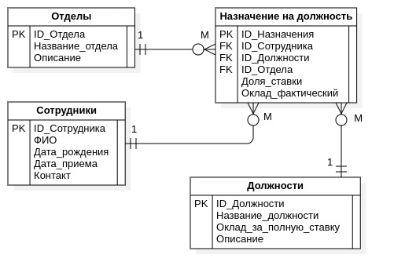

# Задание 2.3.б

Разработайте ER-модель штатного расписания структурных подразделений (отделов)
предприятия (количество должностных ставок по отделам, распределение сотрудников
по отделам и должностям, должностные оклады сотрудников с учетом долей
занимаемых ими должностных ставок), при условии, что:

- разрешены любые совмещения должностей
- должностной оклад сотрудника отдела зависит только от доли должностной ставки
  по занимаемой им должности

## Решение

### Сущность "Отделы"

| Тип атрибута | Атрибут         | Описание                    |
| ------------ | --------------- | --------------------------- |
| Ключевой     | ID_Отдела       | Идентификатор отдела        |
| Описательный | Название отдела | Наименование подразделения  |
| Описательный | Описание        | Назначение и функции отдела |

### Сущность "Должности"

| Тип атрибута | Атрибут                | Описание                       |
| ------------ | ---------------------- | ------------------------------ |
| Ключевой     | ID_Должности           | Идентификатор должности        |
| Описательный | Название должности     | Наименование должности         |
| Описательный | Оклад за полную ставку | Базовый оклад за полную ставку |
| Описательный | Описание               | Функциональные обязанности     |

### Сущность "Сотрудники"

| Тип атрибута | Атрибут       | Описание                 |
| ------------ | ------------- | ------------------------ |
| Ключевой     | ID_Сотрудника | Идентификатор сотрудника |
| Описательный | ФИО           | Полное имя сотрудника    |
| Описательный | Дата рождения | Личные данные            |
| Описательный | Дата приема   | Дата трудоустройства     |
| Описательный | Контакт       | Телефон или email        |

### Ассоциативная сущность "Назначение на должность"

| Тип атрибута | Атрибут           | Описание                                      |
| ------------ | ----------------- | --------------------------------------------- |
| Ключевой     | ID_Назначения     | Уникальная запись назначения                  |
| Внешний ключ | ID_Сотрудника     | Кто занимает должность                        |
| Внешний ключ | ID_Должности      | Какая должность занята                        |
| Внешний ключ | ID_Отдела         | В каком отделе                                |
| Описательный | Доля ставки       | Часть ставки (0.25, 0.5, 1.0 и т.д.)          |
| Описательный | Оклад фактический | Рассчитывается: оклад_должности * доля ставки |

#### Почему нужна сущность "Назначение на должность"?

- сотрудник может работать в нескольких отделах
- сотрудник может занимать несколько должностей
- сотрудник может быть одновременно на разных долях ставки

## ER-модель

