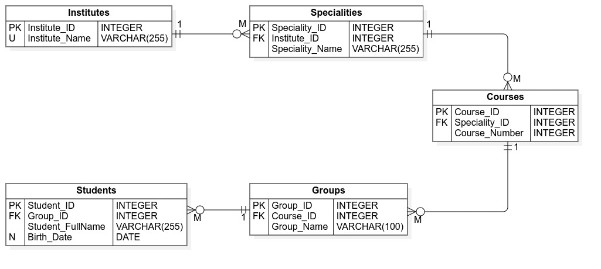

# Задание 3.14

В ER-модели «Управление контингентом студентов университета» определены пять
иерархически агрегированных сущностей:

- Институты
- Специальности
- Курсы
- Группы
- Студенты

между которыми соответственно определены связи кратности "один ко многим".

1. разработайте фрагмент схемы реляционной базы данных на основе этой ER-модели;
2. определите и обоснуйте состав главных (родительских) и подчиненных (дочерних)
   отношений в этой схеме;
3. определите типы данных для внешних ключей подчиненных отношений.

## 1. Схема реляционной базы данных



---

### Институты

```sql
CREATE TABLE Institutes (
    Institute_ID   INT IDENTITY(1,1) PRIMARY KEY,
    Institute_Name NVARCHAR(255) NOT NULL UNIQUE
);
```

---

### Специальности

```sql
CREATE TABLE Specialties (
    Specialty_ID   INT IDENTITY(1,1) PRIMARY KEY,
    Institute_ID   INT NOT NULL,
    Specialty_Name NVARCHAR(255) NOT NULL,

    CONSTRAINT FK_Specialties_Institutes
        FOREIGN KEY (Institute_ID)
        REFERENCES Institutes(Institute_ID)
        ON DELETE CASCADE
);
```

---

### Курсы

```sql
CREATE TABLE Courses (
    Course_ID     INT IDENTITY(1,1) PRIMARY KEY,
    Specialty_ID  INT NOT NULL,
    Course_Number INT NOT NULL,

    CONSTRAINT FK_Courses_Specialties
        FOREIGN KEY (Specialty_ID)
        REFERENCES Specialties(Specialty_ID)
        ON DELETE CASCADE
);
```

---

### Группы

```sql
CREATE TABLE Study_Groups (
    Group_ID   INT IDENTITY(1,1) PRIMARY KEY,
    Course_ID  INT NOT NULL,
    Group_Name NVARCHAR(100) NOT NULL,

    CONSTRAINT FK_Groups_Courses
        FOREIGN KEY (Course_ID)
        REFERENCES Courses(Course_ID)
        ON DELETE CASCADE
);
```

---

### Студенты

```sql
CREATE TABLE Students (
    Student_ID       INT IDENTITY(1,1) PRIMARY KEY,
    Group_ID         INT NOT NULL,
    Student_FullName NVARCHAR(255) NOT NULL,
    Birth_Date       DATE NULL,

    CONSTRAINT FK_Students_Groups
        FOREIGN KEY (Group_ID)
        REFERENCES Study_Groups(Group_ID)
        ON DELETE CASCADE
);
```

---

## 2. Состав главных и подчиненных отношений

Иерархия определяет строгую цепочку _"родитель -> потомок"_:

### Родительские (главные) отношения:

- Institutes
- Specialties
- Courses
- Groups

### Подчиненные (дочерние) отношения:

- Specialties (дочерняя к Institutes)
- Courses (дочерняя к Specialties)
- Groups (дочерняя к Courses)
- Students (дочерняя к Groups)

---

### Обоснование

Каждая связь имеет кратность `1:N`, то есть:

- один институт содержит много специальностей
- одна специальность содержит много курсов
- один курс содержит много групп
- одна группа содержит много студентов

Следовательно:

- родительская сущность -> "1"
- дочерняя сущность -> "N" и содержит внешний ключ на родителя

---

## 3. Типы данных внешних ключей

Для всех внешних ключей действует правило:

> тип внешнего ключа должен полностью совпадать с типом первичного ключа, на
> который он ссылается

---

### Соответствие

| Таблица     | Внешний ключ | Тип данных |
| ----------- | ------------ | ---------- |
| Specialties | Institute_ID | INT        |
| Courses     | Specialty_ID | INT        |
| Groups      | Course_ID    | INT        |
| Students    | Group_ID     | INT        |

---

### Дополнительные требования к FK

- NOT NULL (обязательная принадлежность)
- FOREIGN KEY constraint
