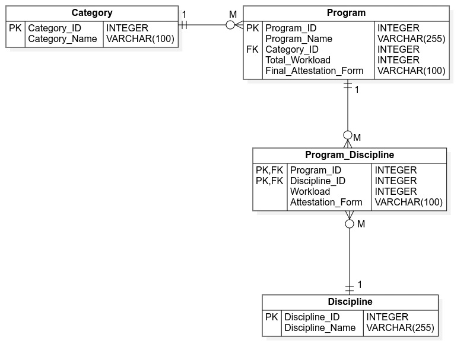
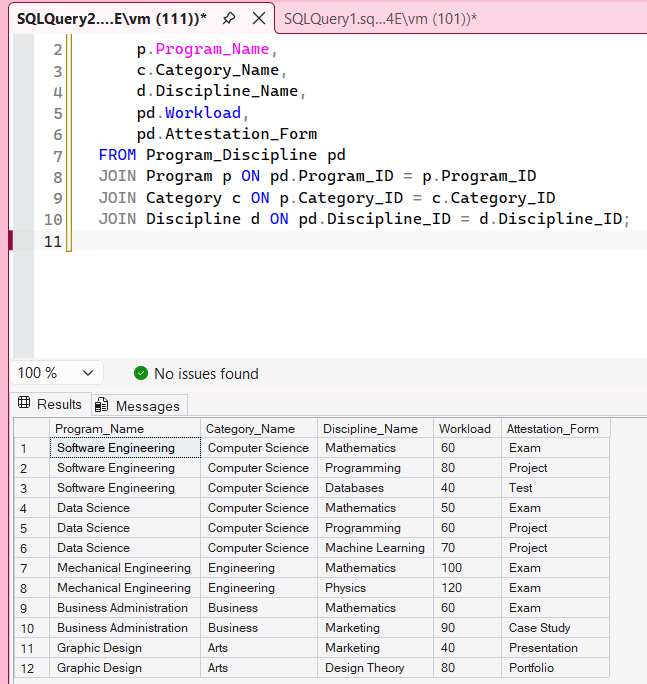

# Задание 3.24

Разработайте схему реляционной БД путем преобразования ER-модели для
информационной системы Центра дополнительного образования.

---

## ER-модель



---

## Схема реляционной базы данных

```sql
CREATE TABLE Category (
    Category_ID INT IDENTITY PRIMARY KEY,
    Category_Name VARCHAR(100) NOT NULL
);

CREATE TABLE Program (
    Program_ID INT IDENTITY PRIMARY KEY,
    Program_Name VARCHAR(255) NOT NULL,
    Category_ID INT NOT NULL,
    Total_Workload INT NOT NULL,
    Final_Attestation_Form VARCHAR(100) NOT NULL
);

CREATE INDEX IX_Program_Category_ID
ON Program (Category_ID);

CREATE TABLE Discipline (
    Discipline_ID INT IDENTITY PRIMARY KEY,
    Discipline_Name VARCHAR(255) NOT NULL
);

CREATE TABLE Program_Discipline (
    Program_ID INT NOT NULL,
    Discipline_ID INT NOT NULL,
    Workload INT NOT NULL,
    Attestation_Form VARCHAR(100) NOT NULL,
    CONSTRAINT PK_Program_Discipline PRIMARY KEY (Program_ID, Discipline_ID)
);

ALTER TABLE Program
ADD CONSTRAINT FK_Program_Category
FOREIGN KEY (Category_ID)
REFERENCES Category(Category_ID);

ALTER TABLE Program_Discipline
ADD CONSTRAINT FK_Program_Discipline_Program
FOREIGN KEY (Program_ID)
REFERENCES Program(Program_ID);

ALTER TABLE Program_Discipline
ADD CONSTRAINT FK_Program_Discipline_Discipline
FOREIGN KEY (Discipline_ID)
REFERENCES Discipline(Discipline_ID);
```

---

### SQL-запросы для тестирования

#### Категории

```sql
INSERT INTO Category (Category_Name) VALUES
('Computer Science'),
('Engineering'),
('Business'),
('Arts');
```

---

#### Образовательные программы

```sql
INSERT INTO Program (Program_Name, Category_ID, Total_Workload, Final_Attestation_Form) VALUES
('Software Engineering', 1, 240, 'Thesis'),
('Data Science', 1, 180, 'Project'),
('Mechanical Engineering', 2, 300, 'Exam'),
('Business Administration', 3, 210, 'Portfolio'),
('Graphic Design', 4, 150, 'Presentation');
```

---

#### Дисциплины

```sql
INSERT INTO Discipline (Discipline_Name) VALUES
('Mathematics'),
('Programming'),
('Databases'),
('Machine Learning'),
('Physics'),
('Marketing'),
('Design Theory');
```

---

#### Дисциплины_Программы

```sql
INSERT INTO Program_Discipline (Program_ID, Discipline_ID, Workload, Attestation_Form) VALUES
(1, 1, 60, 'Exam'),
(1, 2, 80, 'Project'),
(1, 3, 40, 'Test'),

(2, 1, 50, 'Exam'),
(2, 2, 60, 'Project'),
(2, 4, 70, 'Project'),

(3, 1, 100, 'Exam'),
(3, 5, 120, 'Exam'),

(4, 6, 90, 'Case Study'),
(4, 1, 60, 'Exam'),

(5, 7, 80, 'Portfolio'),
(5, 6, 40, 'Presentation');
```

---

#### Просмотр базы данных

```sql
SELECT 
    p.Program_Name,
    c.Category_Name,
    d.Discipline_Name,
    pd.Workload,
    pd.Attestation_Form
FROM Program_Discipline pd
JOIN Program p ON pd.Program_ID = p.Program_ID
JOIN Category c ON p.Category_ID = c.Category_ID
JOIN Discipline d ON pd.Discipline_ID = d.Discipline_ID;
```

---


